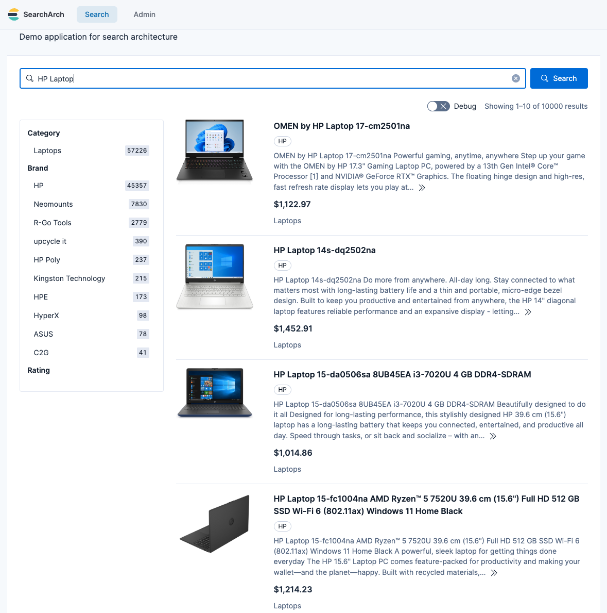

## Introduction

Demonstrating e-commerce search requires a catalog with realistic titles, working images, usable categories and attributes, and sufficient product variety to observe the effect of query rewriting or re-ranking. In other words, the dataset needs to behave like a real catalog — and it can be surprisingly hard to find demo data that is (a) sufficiently large, (b) easy to ingest, and (c) safe to use in commercial settings.

For some query rewriting work I’m involved in, I needed image-rich product catalogs and clean representations of them that could be indexed and iterated on quickly. This article covers the electronics pipeline, which is based on [Open Icecat](https://icecat.biz/) and produces over 1 million usable computer/electronics products. Its companion, [based on Open Food Facts](/data-generation/open-food-facts-grocery-demo-data/), produces over 100K usable grocery products — that article also explains why I chose these two sources over the research datasets I considered (WANDS, Amazon-derived corpora, Kaggle competitions and others).

Icecat data comes in an awkward format for search (nested XML, inconsistent field names, and image metadata that isn’t directly usable), and the harvester converts it into clean NDJSON documents with the same schema as the grocery data.

## The harvester

To produce the electronics demo dataset, I built an open-source transformation pipeline that converts messy product records into clean Elasticsearch-ready NDJSON:

* [**Icecat Harvester**](https://github.com/alexander-marquardt/icecat-harvester/): Downloads Icecat XML and normalizes electronics metadata.

### NDJSON

Elasticsearch ingests JSON documents. [NDJSON](https://github.com/ndjson/ndjson-spec) is a file format that allows one JSON object per line, which is trivial to bulk ingest. The output of the harvester is a clean, stable schema that can be bulk-ingested directly into a search engine.

## Icecat for electronics-style product catalogs

Open Food Facts is excellent for food/CPG. But some demos benefit from an electronics-style catalog with spec-rich attributes and product-type variety. That’s where Icecat is useful.

Icecat is typically consumed via XML interfaces and nested structures that cannot be indexed directly into Elasticsearch. The Icecat harvester repo is designed as data transformation tool, where downloading and parsing are separate steps. That separation matters: you can download once, iterate on schema transformation many times, and regenerate clean NDJSON without re-downloading everything.

### Icecat inclusion criteria (why 25M → 3.5M → 1M)

The raw Icecat index spans more than 25 million data sheets in the global catalog. However, I have targeted a subset of the _open_ index covering only "interesting" categories of products (the desired categories are easily configurable). This subset contains approximately 3.5M data sheets. After further filtering and processing, I end up with about 1M demo-quality products.

The final resulting demo dataset is significantly smaller than the original 25M for the following reasons:

1. **Open vs. full tier**: We specifically target the "Open Icecat" portion of the catalog. While the "Full Icecat" database includes over 28,000 brands, only a subset (the "sponsoring brands" like HP, Lenovo, and Samsung) make their content available via the Open Icecat tier.

2. **Regional/category filtering**: We use a targets.txt file to focus only on high-utility categories (like Laptops and Smartphones). This avoids millions of low-signal categories (e.g., spare parts, cables) that typically clutter a demo search experience.

3. **The demo-ready quality gate**: Our script applies a strict filter: **No Image = No Entry**. A product without a visual asset is a dead-end in a demo UI. By requiring at least one high-resolution image URL and a valid title, we prune the "metadata-only" records that make up a large portion of the raw feed.

4. **Deduplication**: Icecat often provides separate XML files for the same product to handle different languages or minor regional packaging variants. Our pipeline deduplicates these by Product ID, ensuring that the search index contains one canonical record per item rather than many near-identical variants.

### After: Cleaned NDJSON for electronics search

After parsing, filtering, and cleaning over 3.5 million source records, the resulting dataset contains over a million clean JSON objects, that are ready to be indexed into a search engine like Elasticsearch or OpenSearch. 

```json
{
  "id": "91778569",
  "title": "Lenovo Legion 5 15ARH05H AMD Ryzen™ 7 4800H Laptop...",
  "brand": "Lenovo",
  "description": "Minimal meets mighty... Thermally tuned via Legion Coldfront 2.0.",
  "price": 865.33,
  "currency": "USD",
  "image_url": "https://images.icecat.biz/img/gallery_mediums/79117985_5269963235.jpg",
  "categories": ["Laptops"],
  "attrs": {
    "Processor family": "AMD Ryzen™ 7",
    "Internal memory": "16 GB",
    "Weight": "2.46 kg"
  },
  "attr_keys": ["Processor family", "Internal memory", "Weight"]
}
```

### How the data looks

Below is an example of how the cleaned icecat data looks in a simple e-commerce frontend.



## The schema

The goal is that a loader or indexing pipeline can ingest this data and the [Open Food Facts grocery data](/data-generation/open-food-facts-grocery-demo-data/) with the same code path. That’s why both repositories converge on a similar NDJSON structure. For Icecat, each field is populated as follows (the Open Food Facts article has the same table for groceries):

| Field | Type | Source: Icecat Logic (Electronics) |
| :--- | :--- | :--- |
| id | string | Unique Icecat Product ID |
| title | string | Full Marketing Title |
| brand | string | Manufacturer (e.g., Apple, Lenovo) |
| description | string | **Synthesis:** Marketing text + Key Technical Specifications |
| price | float | **Heuristic:** Category baseline modified by Brand premium |
| currency | string | Fixed (USD) |
| image_url | string | **High-Quality:** Selects the best available primary product photo |
| categories | list | Single-item list (primary Icecat category); the Open Food Facts equivalent is `taxonomy_tags` |
| category_path / category_path_primary | list | _Not populated_ (the Open Food Facts data rebuilds these from its category taxonomy) |
| attrs | object | **Flattened:** Technical specs (e.g., `"RAM": "16GB"`) |
| attr_keys | list | List of keys in attrs for dynamic faceting |

### Why this schema works for search
By converging on a single schema contract, the ingestion pipeline and demo UI can remain stable across both datasets. Whether you are indexing 100K olive oils or 1M laptops, the same configuration applies:

- **Consistent faceting**: The attrs object is a flat dictionary. In Elasticsearch, this is typically mapped as a `flattened` field to support dynamic faceting without a mapping explosion.

- **Searchable specs**: High-value technical data is injected into the description field, so a user searching for "Ryzen 7" finds the product via full-text search even if that attribute isn't explicitly boosted. (The Open Food Facts extractor used to do the same and no longer does; [its article](/data-generation/open-food-facts-grocery-demo-data/#why-this-schema-works-for-search) explains why.)

- **Visual reliability**: Both pipelines discard any record missing a valid image_url. This reduces the chances of your demo showing a "broken image" icon.

## Conclusion

If you want to build and demo e-commerce search, the blocker is often the dataset. Icecat is a source that (a) contains the kinds of fields demos need, including images and spec-rich metadata, and (b) has a licensing framework that is clear enough to build on without feeling like you’re stepping into a gray area. The real work — and the real value — is in turning raw, awkward source formats into clean, stable NDJSON that is easy to index, easy to query, and easy to use in demos. Not more, not less.

For demo catalogs that look and feel real, Icecat and [Open Food Facts](/data-generation/open-food-facts-grocery-demo-data/) are the two open foundations I’m using today, and for a vertical neither of them covers there is now a [synthetic industrial catalog](/data-generation/synthetic-industrial-product-catalog/).
