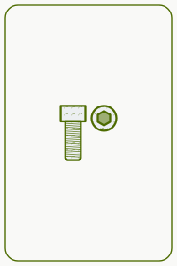
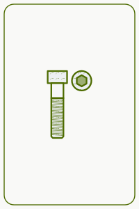
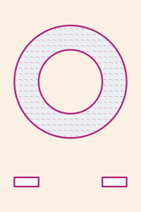
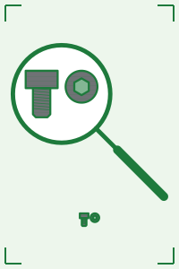
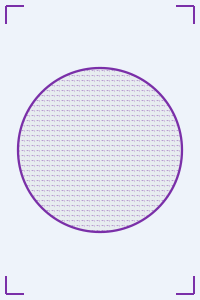

## Introduction

In two earlier articles I described how I turn open data into demo-ready e-commerce catalogs: [groceries from Open Food Facts](/data-generation/open-food-facts-grocery-demo-data/) and [electronics from Icecat](/data-generation/icecat-electronics-demo-data/). Both work because there is an open source with real products, real images and a licence that is clear enough to build on.

For industrial supply — end mills, drills, taps, socket cap screws, hex bolts, washers — I could not find an equivalent. The real catalogs in this vertical are the distributors' own product data, and none of it can be redistributed as a demo asset. So instead of harvesting a catalog, I wrote a generator for one: [**synthetic-industrial-products**](https://github.com/alexander-marquardt/synthetic-industrial-products).

**Every product it produces is synthetic.** No record describes a real product offered by any retailer, the brands are invented, and no retailer's catalog content is redistributed. What *is* taken from the real world is the shape of the domain: which attribute names the industry uses, which dimension combinations are physically real, how titles are constructed, and how often real records are inconsistent.

## Why generate an industrial catalog at all?

A synthetic catalog is usually the thing you settle for when you cannot get real data, and it tends to make demos less convincing: every field populated, every value well-formed, every title built from the same template. That is not what a real catalog looks like, and it does not exercise a search engine the way a real one does.

Industrial supply has one property in particular that is hard to fake convincingly: **attribute-role ambiguity**. The same dimension token legitimately appears in different roles on the same kind of product. A `3/8"` is the cutting diameter on one end mill and the shank diameter on another. A shopper searching for `3/8 end mill` wants the first and not the second, but full-text search matches both.

On the generated catalog, that is measurable. Of the end mills that carry a `3/8"` value anywhere, 88 have a 3/8" cutting diameter, while 53 carry it only as their shank diameter — a full-text match on the token returns all of them, and only a structured filter on the right attribute separates the two. Demonstrating that a search engine handles this correctly requires a catalog whose dimensions are internally coherent and whose collisions happen at a realistic rate, which is exactly what a naive generator does not give you.

## What it generates

With the default configuration, the generator produces **6,327 product lines and 11,614 SKUs across 73 product types**, from 45 invented brands. Thirty of those types are the catalog's *depth*: dozens to hundreds of lines each, with realistic attribute schemas, messiness and drawings. The other 43 are *breadth*: one line of one to three SKUs per category, there so that a query like `1/2 ball` has more of the category tree to land in than end mills, hex keys and bearings, and marked on every record (`spec_quality: "fast_and_cheap"`) so they can be told apart and removed.

| product type | product lines | SKUs |
| :--- | ---: | ---: |
| `nut_hex` | 662 | 1,264 |
| `wheel_depressed_center` | 670 | 1,212 |
| `bearing_radial_ball` | 679 | 1,182 |
| `hex_key` | 630 | 1,120 |
| `end_mill_square` | 498 | 918 |
| `screw_socket_head` | 309 | 579 |
| `end_mill_ball` | 286 | 568 |
| `drill_jobber` | 286 | 530 |
| `bolt_hex` | 235 | 487 |
| `set_screws_hex_socket` | 260 | 485 |
| `lock_nuts_nylon_insert` | 256 | 469 |
| `screw_flat_head` | 180 | 337 |
| `tap_spiral_point` | 179 | 329 |
| `screw_button_head` | 130 | 251 |
| `abrasive_flap_disc` | 129 | 232 |
| `washer_flat` | 135 | 225 |
| `screw_low_head` | 104 | 190 |
| `hammer_ball_pein` | 98 | 184 |
| `shackles` | 74 | 132 |
| `roller_chain_sprockets` | 54 | 102 |
| `roller_chain_links` | 52 | 94 |
| `pillow_block_bearings` | 43 | 90 |
| `turnbuckles` | 42 | 87 |
| `retaining_rings_external` | 39 | 82 |
| `key_stock` | 42 | 70 |
| `roller_chain` | 40 | 68 |
| `cotter_pins` | 39 | 67 |
| `o_rings` | 38 | 66 |
| `dowel_pins` | 36 | 60 |
| `kit_assortment` | 59 | 59 |
| 43 breadth categories (ball stock, threaded rod, hose clamps, safety glasses, …) | 43 | 75 |

Across those types the catalog publishes **119 distinct attribute names**, with a category path for every product (for example `Milling > End Mills > Square End Mills`).

### Product lines and SKUs

The data model follows how industrial catalogs are actually organised. **A parent is one manufacturer's product line, and its children are the individual purchasable SKUs.** Attributes that are constant across the line (brand, series, material, coating, flute count, end style) live on the parent; the ones that vary (cutting diameter, length of cut, overall length, shank diameter, price, stock) live on each SKU. Lines are never grouped across brands: two manufacturers' tools at the same nominal geometry are different products.

Attributes are key-value pairs, and a measurement carries both its published text and a parsed number in the same entry:

```json
{"name": "Milling Dia.", "value": "3/8\"", "value_num": 0.375}
```

A shopper filters on the published text and ranges over the number, and keeping them on one entry preserves the fact that they are one attribute. The number is parsed *back out of* the published string rather than carried beside it, so the two can never disagree. An attribute that is not a measurement has no `value_num` at all, and neither does a measurement whose value is deliberately malformed.

### Two shapes from one catalog

A single build writes the same generated products in two shapes, so any difference in what they return is a property of the shape rather than of the data:

| file | shape |
| :--- | :--- |
| `nested.jsonl` | one document per product line, with its SKUs and key-value attributes nested |
| `flat.jsonl` | one document per SKU, with attributes denormalised, plus sanitised per-attribute `facets` / `facets_num` fields |
| `images.jsonl` | one row per SKU drawing: its path, its URL, the sha256 of its bytes, and whether its geometry came from the record (`record`, `partial` or `nominal`) |
| `render.jsonl` | the original twelve types' SKUs, in the shape an older, dimensioned renderer reads; the catalog's own drawings do not use it |
| `stats.json` | what was generated, measured against the statistics it reproduces |

Elasticsearch mappings for both shapes (`mapping.flat.json`, `mapping.nested.json`) ship alongside them. Here is one SKU from the flat shape, trimmed to its interesting fields:

```json
{
  "sku": "97NR28",
  "product_id": "OST-K663-0001",
  "product_type": "end_mill_square",
  "title": "High Speed Steel Square End Mill, 8mm dia., High Speed Steel, AlTiN,4 Fl",
  "description": "High Speed Steel Square End Mill, 8mm dia., High Speed Steel, AlTiN,4 Fl - 8mm Shank Dia., 32mm Length of Cut, 52mm Overall Length, Osterlund K663",
  "parent_title": "Osterlund K663 -- High Speed Steel Square End Mill",
  "brand": "Osterlund",
  "series": "K663",
  "category_path": ["Milling", "End Mills", "Square End Mills"],
  "dimension_provenance": "generated from the conventional tool series; no standard fixes these values",
  "price_usd": 8.74,
  "stock": 36,
  "image_url": "https://alexmarquardt.com/ecommerce-demo-assets/images/industrial/end_mill_square/OST-K663-0001/card.png",
  "attributes": [
    {"name": "End Mill Style", "value": "Square"},
    {"name": "End Mill Material", "value": "High Speed Steel"},
    {"name": "Finish - Machining", "value": "AlTiN"},
    {"name": "Number of Flutes", "value": "4", "value_num": 4.0},
    {"name": "Milling Dia.", "value": "8mm", "value_num": 0.31496062992125984},
    {"name": "Shank Dia.", "value": "8mm", "value_num": 0.31496062992125984},
    {"name": "Length of Cut", "value": "32mm", "value_num": 1.2598425196850394},
    {"name": "Overall Length", "value": "52mm", "value_num": 2.047244094488189}
  ],
  "facets": {"milling_dia": ["8mm"], "shank_dia": ["8mm"], "finish_machining": ["AlTiN"]},
  "facets_num": {"milling_dia": 0.31496062992125984, "shank_dia": 0.31496062992125984}
}
```

The `facets` object exists because `Milling Dia.` cannot be an Elasticsearch field name (the trailing dot makes it an invalid path), so each attribute gets a sanitised key of its own.

### Why the flat shape is not enough

The flat shape is easy to load, but it has a well-known weakness that the catalog makes visible. In the flat document the `attributes` array is a plain object, so `name` and `value` become two independent multi-valued fields and the pairing between them is lost. On the committed catalog, filtering for *name = `Shank Dia.` AND value = `3/8"`* matches **205** documents, but only **129** of them actually have a 3/8" shank; the other 76 carry a 3/8" that belongs to some other attribute.

That is why the flat shape also carries the per-attribute `facets.*` keys, where the pairing cannot come apart, and why the nested shape exists at all: with nested documents and `reverse_nested`, "how many *products* have this value" becomes answerable.

## Where the realism comes from

### Observed statistics, generated products

The **schema** and the **statistical distributions** are derived from observing publicly archived catalog pages of a real industrial distributor: attribute names, which dimension combinations occur together, how often roles collide, how titles are built, and how often records contradict themselves. Those are facts about the domain. The **products** are generated; they are not real records with the names changed.

That distinction is enforced rather than asserted. The repository ships *hashes* of the reference records' full attribute tuples (never the records themselves), and the test suite checks that no generated product matches any of them. The comparison is over the whole tuple rather than field by field, because agreeing with a published standard on one dimension is not copying — every real `#10` flat head cap screw has the same head diameter — whereas reproducing a complete record would be.

### Dimensions: standards for fasteners, conventional series for cutting tools

The two halves of the catalog get their dimensions differently, and every product line says which:

- **Fasteners** are **standards-derived**. Each line carries the standard its dimensions came from (`ISO 4762`, `ISO 7089`, `DIN 933`, `ASME B18.3` and so on). The values were extracted from open-source CAD fastener libraries — primarily the [FreeCAD Fasteners workbench](https://github.com/shaise/FreeCAD_FastenersWB), with [BOLTS](https://github.com/boltsparts/boltsparts) as corroboration — rather than transcribed by hand, and only the sizes the catalog offers were taken. A size the sources do not carry is absent rather than invented.
- **Cutting tools** are **generated** from the conventional size series. There is no open dimensional source for end mills, so nothing on those lines claims a standard, and the provenance field says so in words (you can see it in the record above).

The asymmetry is deliberate: a cap screw's head is fixed by a published standard and a catalog that disagrees with it is wrong, while an end mill's length of cut is a manufacturer's choice within a conventional range.

### Realistic messiness

Real catalogs are messy, and a search demo on a perfectly clean catalog proves very little. The generator reproduces the defect classes found in the reference data rather than smoothing them away — inconsistent unit formatting within a record, ragged attribute coverage, unlabelled dimension tokens in titles, and occasional internally impossible dimensions. Each rate is reproduced against its own denominator (the records that actually carry the attributes involved), and `sip-generate report` prints what was achieved beside the target:

| measured property | target | achieved |
| :--- | ---: | ---: |
| shank diameter == cutting diameter | 0.6489 | 0.5784 |
| length of cut > overall length | 0.0829 | 0.0842 |
| an angle attribute carries a length unit | 0.0469 | 0.0299 |
| declared measurement system contradicts the value's units | 0.0323 | 0.0301 |
| unit mixing within one record | 0.0222 | 0.0215 |
| title dimension token carries no label | 0.4667 | 0.4600 |
| title dimension token is not the primary dimension | 0.1714 | 0.1736 |
| attributes per record (mean) | 13.12 | 13.69 |

Even the attribute *names* are inconsistent in the way real data is. The measurement-system attribute appears under three different names (`Dimension Type`, `Measurement System` and `System of Measurement`), and the flat shape deliberately keeps them as three separate keys: folding them together at generation time would hide exactly the problem a search layer has to solve.

Titles vary the same way. These are nine SKUs from one product line, a single series of square end mills:

```text
High Speed Steel Square End Mill, 8mm dia., High Speed Steel, AlTiN,4 Fl
High Speed Steel Square End Mill, 10mm D, High Speed Steel, AlTiN, 4 FL
High Speed Steel Square End Mill, 6mm Milling Dia., High Speed Steel, AlTiN, 4 FL
High Speed Steel Square End Mill, 38mm Overall Length, 16mm Cut L, HSS, AlTiN, 4 FL, DBL Sq End
High Speed Steel Square End Mill, 25mm D, High Speed Steel, AlTiN, 4 FL
High Speed Steel Square End Mill, 16mm, HSS, AlTiN, 4 FL, DBL Sq End
Osterlund High Speed Steel Square End Mill, 20mm, High Speed Steel, AlTiN, 4 FL
High Speed Steel Square End Mill, 12mm,High Speed Steel, AlTiN, 4 Flutes
High Speed Steel Square End Mill, 38mm L, 12mm Length of Cut, High Speed Steel, AlTiN, 4 FL
```

The diameter is labelled `dia.`, `D`, `Milling Dia.`, or not at all; `High Speed Steel` is sometimes `HSS`; the flute count is `Fl`, `FL` or `Flutes`; the brand appears in some titles and not others; and two of the titles lead with a length rather than the diameter. All of that is realistic, and all of it is something a query parser has to cope with.

The messiness is bounded by a few rules that keep the catalog usable. Every title names a value that is unique to that SKU within its line, so no two SKUs in a line share a title or a description. The description opens with the title verbatim and then continues with the remaining distinguishing attributes, which is the convention real listings follow: the title tells SKUs apart at a glance, the description while scanning, and the attribute block precisely.

## Generated technical drawings

A demo catalog without images is not a demo catalog, and industrial product photography is exactly the content that cannot be borrowed. Photographs of a generated product cannot exist, since the product does not, and a picture taken from somewhere else would show a real product the record does not describe. So the generator also draws the pictures, and it draws them from the records.

**Every SKU has a drawing of its own, drawn from that SKU's own published values.** The default build has 11,614 SKUs and 11,614 drawings. Two lengths of one socket head cap screw therefore look different, and a grouped product page can switch the picture when a shopper picks a different size. That is a deliberate departure from real distributor catalogs, which mostly show one photograph for a whole series. A generated drawing costs nothing per size, so there is no reason to copy that habit.

| M10 × 25 mm | M10 × 45 mm | M4 washer | M20 washer |
| :---: | :---: | :---: | :---: |
|  |  |  |  |

The first two are SKUs of one product line, a stainless M10 socket head cap screw at two lengths; the second two are SKUs of one flat-washer line. Every drawing in this article is the generator's output, unedited, and each is under 3 KB of SVG.

### What "parameterized" means here

Each drawing is a pure function of three things: the product type, the brand, and the SKU's published attributes. Nothing is styled from an identifier and nothing is random, so the same record always produces the same bytes. A drawing is built in three steps:

1. **Attributes to geometry.** Every drawn product type has a figure function that reads the record's published values (thread size and length for a screw; diameter, length of cut and flute count for an end mill; bore, outside diameter and closure type for a bearing) and builds the part as shapes measured in inches. It reads those values through the same parsing code as the rest of the generator, so the drawing and the data cannot disagree about what a record says.
2. **Geometry to sheet.** The part is placed on a 200 × 300 sheet at its product type's scale.
3. **Sheet to SVG.** A small SVG writer in the generator itself, about a hundred lines of plain Python, writes out the paths, circles and fills. No drawing or plotting library is involved; [How the drawings are made](#how-the-drawings-are-made) below shows how that works. A drawing averages about 2 KB: the 11,614 drawings come to 24 MB, or about 2.6 MB as a compressed archive.

The specifications show up visually rather than as text. A longer length of cut is drawn longer and a finer thread with more crests. A flat head is drawn as a cone and a button head as a dome. A sealed bearing is drawn closed, while an open one shows its balls. The other visual channels map to the record in the same way:

| channel | driven by |
| :--- | :--- |
| shape and proportions | the SKU's own dimensions |
| flutes and thread crests | the published flute count and thread pitch |
| fill tint | the finish (TiAlN is violet-grey, TiN gold, black oxide dark), otherwise the bare material's colour |
| section hatch | the material, as engineering drawings already denote it |
| outline ink, paper tint, frame | the brand's house style |

Each of the 45 brands owns one house style: an ink, a paper tint and a frame. A brand's drawings look like a set and two brands' drawings look different, which is the role a manufacturer's photography style plays in a real catalog. Rotation, tilt and random decoration were considered and rejected because they correspond to no product property. A reader who sees two tools drawn differently concludes the difference is real, and with the drawing driven by the record, that conclusion is correct.

The default build has 11,163 distinct drawings for its 11,614 SKUs. Every repeat is one brand drawing the same values twice. Mostly that is one part listed in more than one product line (for example, the same 607-size double-shielded chrome-steel bearing appears in three), and in 29 cases it is two SKUs of one line whose drawn values are the same. An identical picture is the right answer there.

### The honesty rules

The drawings follow a few rules, and the generator's tests check each one over the committed catalog:

- **No text of any kind.** A drawing carries no dimension, callout, label, brand name or SKU. The words are already on the record (title, description, attributes), and repeating them in the picture would be redundant, and would also tie a drawing to wording that can change. The check is an allow-list of the SVG elements and attributes the figures emit, rather than a search for text, so a `<title>`, a comment, an embedded font or an external reference all fail it.
- **One true scale per product type.** Every SKU of a type is drawn at the same scale, so any two parts of a type are in true proportion. The M4 and M20 washers above are drawn at 9 mm and 37 mm across, in exactly that ratio. A screw or bolt longer than its type's sheet is drawn broken, with its shank shortened between two drafting break lines, rather than shrunk.
- **A magnifier for tiny parts, never an enlargement in place.** A part too small to see at its type's scale is still drawn at that scale, near the bottom of the sheet, and a lens above it shows the same part enlarged. The lens is a magnifying glass where the glass can enlarge the part at least 2.5 times, and a larger, handle-less circle otherwise. In the default build, 2,260 SKUs get a lens: 784 the magnifying glass and 1,476 the handle-less circle.

  

- **The drawing cannot contradict the record.** Real catalogs omit attributes, and this one deliberately does too. When a drawn value is missing, unparseable or contradicts another value, that one value is drawn with a nominal proportion for its kind, and every value the record does publish consistently is still drawn exactly. Because the drawing carries no numbers, a nominal proportion never asserts a size that the record disputes. The manifest records, per SKU, whether the drawing came entirely from the `record`, was `partial`, or is `nominal`, so the share is reported rather than hidden.

### How many types are drawn from the record today

| drawing | product types | SKUs |
| :--- | ---: | ---: |
| drawn entirely from the record | 30 | 9,186 |
| drawn from the record, with a nominal proportion for a missing or inconsistent value | (same 30) | 2,353 |
| a fixed placeholder shape | 43 | 75 |

All 30 depth types have a figure of their own: cutting tools, socket, set and flat-head screws, bolts, plain and lock nuts, washers, ball and pillow-block bearings, abrasive wheels and discs, hex keys, hammers, roller chain and sprockets, pins, retaining rings, O-rings, key stock, shackles, turnbuckles and assortment kits. The `partial` drawings are mostly hex keys, drills, end mills, lock nuts and taps whose records leave out, or contradict, a secondary dimension such as a length or a shank diameter.

The 43 breadth categories are drawn as one of six fixed placeholder shapes: a sphere, a cylinder, a block, a disc, a tube or a bracket. Each is coloured and hatched from the record's material and finish like any other drawing, but its geometry is identical whatever the record says, so a 1/8" ball and a 1/2" ball get the same picture. That is intentional. A placeholder makes no claim about size, whereas a drawing scaled from deliberately cheap filler data would claim a precision that the data does not have.



Moving a category from placeholder to drawn-from-the-record takes one new figure function for that type, not more data. More types will move across as the catalog grows. The [generator's README](https://github.com/alexander-marquardt/synthetic-industrial-products#images) has the code-level detail: the scale per type, the magnifier rule, and what the tests assert.

### Getting the drawings

The drawings are not committed to the generator's repository. Each record carries a relative `image_url` (`/images/industrial/<product type>/<product line>/<sku>.svg`), and one command rebuilds every drawing from the committed catalog into a folder and a deterministic archive that a demo serves itself:

```sh
uv run sip-generate images --catalog golden-catalog --out out/images --archive out/images.tar.gz
```

It refuses to finish unless every drawing's sha256 equals the one `images.jsonl` records for it, so a bundle can never drift from the catalog it belongs to.

The industrial drawings browsable under [E-commerce Demo Assets](/ecommerce-demo-assets/images/industrial/) on this site are from the generator's earlier version: one drawing per product line, with the line's attributes printed beside the part. They remain as a browsable sample and are not what the current catalog points at. To get the current drawings, build them with the command above.

## How the drawings are made

There is no SVG library or drawing tool behind these pictures, and nobody draws them by hand either. The *writer* is hand-written: a short Python module that knows how to print a rectangle, a circle and a path as SVG text. Every coordinate it prints is computed from the record's own numbers, so a longer screw produces a longer path and a wider washer a larger radius. This turned out to be a quick way to give a demo catalog real product pictures, and it is worth showing how it works.

### Plain Python, standard library only

The SVG writer is about a hundred lines. It keeps an ordered list of elements, registers each hatch pattern once in a `<defs>` block, and joins the lot into one string. The drawing code around it imports nothing from outside Python's standard library and the generator's own modules: `math` for the geometry, `dataclasses` for the shapes, and `xml.etree` for the check that reads each finished file back. (The package still installs matplotlib, because the older renderer described below uses it and the drawing code reuses that renderer's attribute readers, but matplotlib draws none of the SVG.)

A figure library was the obvious alternative, and the generator's first version did use matplotlib. It is the wrong tool for this job for three reasons:

- **Size.** A figure library's SVG carries metadata, clip-path ids and glyph definitions. A card came out at about 6 KB with live text, or about 26 KB with the text as glyph paths. The hand-written output is a few hundred bytes to a few KB.
- **Determinism.** Every coordinate is printed with at most one decimal, attributes are written in a fixed order, and pattern definitions are sorted by id. The same record produces the same bytes on any machine, which is what lets the manifest pin each drawing by its sha256.
- **No text.** The drawings carry no text at all. Emitting only seven element types (`svg`, `rect`, `defs`, `pattern`, `g`, `path`, `circle`) makes that rule checkable: the test is an allow-list of elements, attributes and value shapes, not a search for text.

### From a record to a drawing

A drawing is composed in four layers, each a small module:

1. **A figure function per product type** reads the published values and returns shapes measured in inches: polygons, discs, bars, line sets and dots. Each shape has a role, such as the part itself, a plain face or a hole.
2. **The sheet** places the figure on a 200 × 300 page at its product type's single scale, which is the usable sheet divided by the type's largest extent. It adds the magnifier when the part is too small to see, and draws the brand's frame.
3. **The style** picks the colours. The brand sets the ink, the paper tint and the frame (twelve inks, six tints, four frames; no two brands share an ink and a frame). The finish sets the part's fill, or the bare material's colour if no finish is published. The material sets the section hatch, the way engineering drawings already denote it: plain lines at different angles for the steels, a cross-hatch for carbide, a stipple for sintered powder, dotted lines for the elastomers.
4. **The writer** turns all of that into SVG.

This is the complete figure function for a flat washer:

```python
def washer(record: Record) -> Drawn:
    geom, source = _read(record, washer_geom.geometry_from_record, {}, WASHER_NOMINAL)
    od, i_d, t = geom.outside_d.inches, geom.inside_d.inches, geom.thickness.inches
    fig = Figure(size_in=od)
    fig.disc((0.0, 0.0), od / 2)
    fig.disc((0.0, 0.0), i_d / 2, "hole")
    edge = od / 2 + 0.35 * od
    fig.rect(-od / 2, edge, -i_d / 2, edge + t, "plain")
    fig.rect(i_d / 2, edge, od / 2, edge + t, "plain")
    return Drawn(fig, source)
```

`_read` takes the outside diameter, the inside diameter and the thickness from the record. It falls back to a nominal proportion only for a value that is missing or inconsistent, and it reports which happened as `source`. The function draws the face as two discs and the edge view as two bars. Everything else (scale, colour, hatch, frame, lens) comes from the shared layers. This is the face of the M20 washer from earlier, with line breaks added:

```xml
<pattern id="h45s8dc0392b" width="8" height="8" patternUnits="userSpaceOnUse">
  <g stroke="#c0392b" fill="#c0392b" opacity=".45"><path d="M0 0V8" stroke-width=".5" transform="rotate(45 4 4)"/><circle cx="4" cy="0" r=".6"/></g></pattern>
<circle cx="100" cy="115.7" r="79.6" fill="#eceff1" stroke="#c0392b" stroke-linejoin="round" stroke-width="2.3"/>
<circle cx="100" cy="115.7" r="79.6" fill="url(#h45s8dc0392b)"/>
<circle cx="100" cy="115.7" r="45.2" fill="#faf1e4" stroke="#c0392b" stroke-linejoin="round" stroke-width="2.3"/>
```

The pattern is the hatch for 18-8 stainless steel: a 45° line every 8 units, dotted, in the brand's red ink. The washer type is drawn at about 109 sheet units per inch, so a 37 mm outside diameter becomes a radius of 79.6 and the 21 mm bore a radius of 45.2. The bore is filled with the brand's paper tint, so it reads as a hole. The M4 washer, of the same brand and material, is the same elements with smaller radii.

### SVG in, SVG out: no rasterizer

Nothing in the current pipeline rasterizes an SVG. A record's `image_url` and `image_detail_url` both point at its SVG, and the browser draws it at whatever size the page needs. The generator ships no SVG-to-PNG converter, and none is needed.

The PNG files come from the generator's older renderer, which is still in the repository: one drawing per product line, drawn with matplotlib's Agg backend and saved with `savefig` as a `card.png` and a `detail.png`, with the software metadata stripped so the bytes are reproducible. Those are the files under E-commerce Demo Assets mentioned above.

### Why this is fast to extend, and why it suits demos

A new product type needs one figure function and an entry giving the type's largest extent. The washer's function is ten lines; a screw, with its head styles, threads and break lines, is about a hundred. The sheet, scale, magnifier, house style, fills, hatching, the SVG writer, the allow-list check and the manifest all come with it. The previous revision of this article counted 17 types drawn from their records; there are now 30. Building all 11,614 drawings, and checking each one's digest against the catalog, takes about eight seconds on a laptop.

For a demo, the property that matters most is that **the picture never contradicts the record**. It is computed from the same parsed values the search engine indexes, so when a shopper filters to a 45 mm screw, the picture shows a longer screw than the 25 mm one. These are schematics, not photographs, and they claim no more than the record does. A value the record leaves out is drawn at a nominal proportion and reported as `partial`, and a category without a figure gets a placeholder that claims no size at all.

The same approach extends to parametric apparel drawings, with colour and pattern as fills.

## Using it

The generator is a Python package managed with [uv](https://docs.astral.sh/uv/). A build is deterministic: one seed produces one catalog, byte for byte.

```sh
git clone https://github.com/alexander-marquardt/synthetic-industrial-products.git
cd synthetic-industrial-products
uv sync
uv run sip-generate build --out out/catalog   # writes the files above
uv run sip-generate report                    # the measured-vs-target table only
```

Everything is parameterised, because the point of a synthetic catalog is to be dialled until something breaks:

```sh
uv run sip-generate build --lines 900               # a bigger or smaller catalog
uv run sip-generate build --sparsity 0.4             # raggeder attribute coverage
uv run sip-generate build --defects 0.0              # a catalog with no contradictions
uv run sip-generate build --seed 7                   # a different catalog
```

`--image-base-url` changes where the records' image URLs point, and `sip-generate images` (above) renders the drawings themselves.

If you just want the data, you do not need to run anything: the default build is committed to the repository under `golden-catalog/`, as plain NDJSON so that a change to the generator shows up as a readable diff. Loading the flat shape into Elasticsearch takes the committed mapping and a bulk request:

```sh
ES=http://localhost:9200
curl -X PUT "$ES/industrial-products" -H 'Content-Type: application/json' \
  --data-binary @golden-catalog/mapping.flat.json

jq -c '{index: {_id: .sku}}, .' golden-catalog/flat.jsonl > bulk.ndjson
curl -X POST "$ES/industrial-products/_bulk?refresh=true" \
  -H 'Content-Type: application/x-ndjson' --data-binary @bulk.ndjson
```

For a larger generated catalog, split `bulk.ndjson` into chunks (for example with `split -l 2000`) so that no single request gets too large.

The repository also contains a verification script that loads both shapes into a local test cluster and checks that every number Elasticsearch returns — facet counts, range filters, the `3/8"` shank-versus-cutting-diameter case — equals one computed independently in Python from the generated objects, and a customization package for PRISM, the search governance layer from the [e-commerce videos](/#ecommerce-videos) on my homepage.

## What's next

The catalog has grown from twelve product types to 73, and from one drawing per product line to one per SKU. For the drawings, 30 types are drawn from their records today and 43 still use placeholder shapes; each placeholder category that gets a figure of its own becomes a drawing that changes with its specifications, and more are coming. The generator can also build a catalog of more than 100,000 SKUs (`--lines 39000` gives 122,324), with a drawing for every one of them, and I will update this article as those land.

## Conclusion

Open Food Facts and Icecat give me real products for groceries and electronics. For industrial supply there is no open equivalent, so the next best thing is a generator that is honest about what it is: synthetic products, whose schema, distributions, messiness and even pictures are all derived from — and checked against — how real catalogs in the domain behave. The result is a catalog that is safe to share, reproducible from a seed, and awkward in all the ways that make a search demo worth watching.
