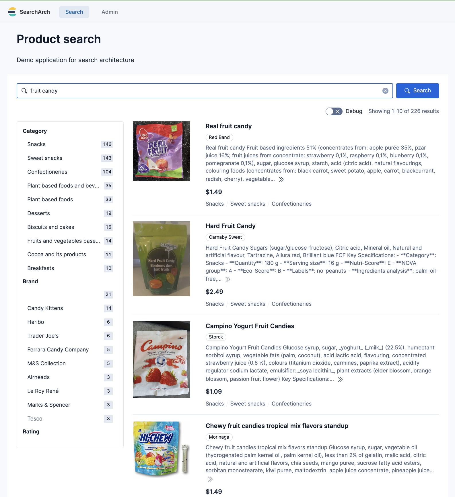
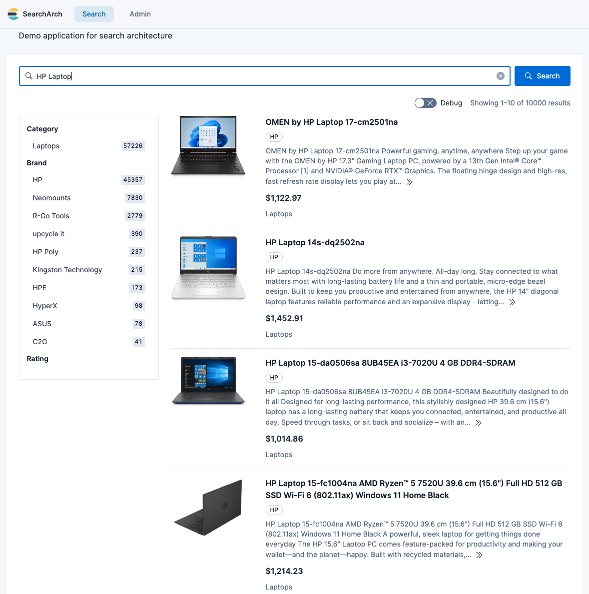

## Introduction

Demonstrating e-commerce search requires a catalog with realistic titles, working images, usable categories and attributes, and sufficient product variety to observe the effect of query rewriting or re-ranking. In other words, the dataset needs to behave like a real catalog.

In practice, it can be surprisingly hard to find demo data that is (a) sufficiently large, (b) easy to ingest, and (c) safe to use in commercial settings. A common workaround is to use a smaller dataset, a synthetic catalog, or a source format that requires significant one-off parsing. That tends to make demos less convincing and reduces the likelihood that the same experience can be reproduced on real-world production catalogs.

For some query rewriting work I’m involved in, I needed an image-rich product catalog and a clean representation of that catalog that could be indexed and iterated on quickly. To support this, I built two tools that take data from open sources and output demo-ready NDJSON. One pipeline is based on [Open Food Facts](https://es.openfoodfacts.org/) and produces over 100K usable grocery products; the other is based on [Open Icecat](https://icecat.biz/) and produces over 1 million usable computer/electronics products. These tools take data that often comes in awkward formats (nested JSON/XML, inconsistent field names, and image metadata that isn’t directly usable) and convert it into clean NDJSON documents with a consistent schema.

## The harvesters

To produce demo datasets, I built two open-source transformation pipelines. These tools convert messy product records into clean Elasticsearch-ready NDJSON:

* [**Icecat Harvester**](https://github.com/alexander-marquardt/icecat-harvester/): Downloads Icecat XML and normalizes electronics metadata.
* [**Open Food Facts Extractor**](https://github.com/alexander-marquardt/open-food-facts-ndjson-extractor): Parses Open Food Facts JSONL and extracts grocery attributes and images.

### NDJSON

Elasticsearch ingests JSON documents. [NDJSON](https://github.com/ndjson/ndjson-spec) is a file format that allows one JSON object per line, which is trivial to bulk ingest. The output of these harvesters is a clean, stable schema that can be bulk-ingested directly into a search engine.

## Dataset #1: Open Food Facts as a demo catalog

Open Food Facts is not an “e-commerce” dataset in the Amazon sense. It is a product database built for transparency: ingredients, allergens, nutrition, and label-derived metadata. The reason it works well for demos is that it still behaves like a real product catalog: it has product names, categories, and images. Importantly, its data reuse posture is explicit and documented (ODbL for the database; CC BY-SA for images). That clarity matters when you intend to show a dataset to customers.

The raw Open Food Facts export is a large JSONL file with a lot of structure. The extractor repository turns it into clean NDJSON that is immediately indexable. It also computes image URLs based on the official image URL scheme, and it can apply quality gates such as “English titles/descriptions” and “must have a front image.”

### Open Food Facts inclusion criteria

After parsing, filtering, and cleaning over 4.2 million source records from Open Food Facts, the resulting dataset contains over 100K clean JSON objects. This reduction is expected: the extractor is intentionally strict because the goal is a catalog suitable for demos.

A record is included only if it meets all of the following:

- English title and description
- A usable front image
- At least one meaningful category (placeholder/empty categories are excluded)
- A category hierarchy that resolves against the Open Food Facts taxonomy (products whose `category_path` can't be reconstructed are dropped by default, so every product is drill-down faceable)

This is intentional: for demos, incomplete products (missing images or categories) are usually not useful.

### After: Cleaned NDJSON for grocery search

This resulting data is ready to be indexed into a search engine like Elasticsearch or OpenSearch, and looks as follows:

```json
{
  "id": "0008127000019",
  "title": "Extra virgin olive oil",
  "brand": "Athena Imports",
  "description": "Extra virgin olive oil. Extra virgin olive oil",
  "image_url": "https://images.openfoodfacts.org/images/products/000/812/700/0019/front_en.5.400.jpg",
  "price": 14.29,
  "margin": 22,
  "popularity": 0,
  "currency": "USD",
  "taxonomy_tags": [
    "Plant-based foods and beverages",
    "Plant-based foods",
    "Fats",
    "Vegetable fats",
    "Olive tree products",
    "Vegetable oils",
    "Olive oils",
    "Extra-virgin olive oils",
    "Virgin olive oils"
  ],
  "category_path": [
    "Plant-based foods and beverages",
    "Plant-based foods and beverages/Plant-based foods",
    "Plant-based foods and beverages/Plant-based foods/Olive tree products",
    "Plant-based foods and beverages/Plant-based foods/Olive tree products/Olive oils",
    "Plant-based foods and beverages/Plant-based foods/Olive tree products/Olive oils/Virgin olive oils",
    "Plant-based foods and beverages/Plant-based foods/Olive tree products/Olive oils/Virgin olive oils/Extra-virgin olive oils",
    "Fats",
    "Fats/Vegetable fats",
    "Fats/Vegetable fats/Vegetable oils",
    "Fats/Vegetable fats/Vegetable oils/Olive oils",
    "Fats/Vegetable fats/Vegetable oils/Olive oils/Virgin olive oils",
    "Fats/Vegetable fats/Vegetable oils/Olive oils/Virgin olive oils/Extra-virgin olive oils",
    "Plant-based foods and beverages/Plant-based foods/Vegetable fats",
    "Plant-based foods and beverages/Plant-based foods/Vegetable fats/Vegetable oils",
    "Plant-based foods and beverages/Plant-based foods/Vegetable fats/Vegetable oils/Olive oils",
    "Plant-based foods and beverages/Plant-based foods/Vegetable fats/Vegetable oils/Olive oils/Virgin olive oils",
    "Plant-based foods and beverages/Plant-based foods/Vegetable fats/Vegetable oils/Olive oils/Virgin olive oils/Extra-virgin olive oils"
  ],
  "category_path_primary": [
    "Plant-based foods and beverages",
    "Plant-based foods and beverages/Plant-based foods",
    "Plant-based foods and beverages/Plant-based foods/Olive tree products",
    "Plant-based foods and beverages/Plant-based foods/Olive tree products/Olive oils",
    "Plant-based foods and beverages/Plant-based foods/Olive tree products/Olive oils/Virgin olive oils",
    "Plant-based foods and beverages/Plant-based foods/Olive tree products/Olive oils/Virgin olive oils/Extra-virgin olive oils"
  ],
  "attrs": {
    "Serving size": "15 ml",
    "Nutri-Score": "B",
    "NOVA group": "2",
    "Eco-Score": "E",
    "Ingredients analysis": [
      "palm-oil-free",
      "vegan",
      "vegetarian"
    ],
    "Countries": "United States",
    "Category": "Plant-based foods and beverages",
    "Energy (kcal/100g)": "800 kcal",
    "Fat (g/100g)": "93.3 g",
    "Saturated fat (g/100g)": "13.3 g",
    "Sugars (g/100g)": "0 g",
    "Salt (g/100g)": "0 g",
    "Protein (g/100g)": "0 g",
    "Dietary restrictions": [
      "vegan",
      "vegetarian"
    ],
    "Price source": "estimated_unit_model",
    "Pricing bucket": "olive_oil",
    "Estimated unit price": "28.68 USD/l (default 500ml (no package qty), source=none, bucket=olive_oil)",
    "Margin source": "modelled_category_margin",
    "Modelled margin": "22% (bucket=olive_oil base=22%)",
    "Popularity source": "open_food_facts_unique_scans",
    "Unique scans (Open Food Facts)": "0"
  },
  "attr_keys": [
    "Category",
    "Countries",
    "Dietary restrictions",
    "Eco-Score",
    "Energy (kcal/100g)",
    "Estimated unit price",
    "Fat (g/100g)",
    "Ingredients analysis",
    "Margin source",
    "Modelled margin",
    "NOVA group",
    "Nutri-Score",
    "Popularity source",
    "Price source",
    "Pricing bucket",
    "Protein (g/100g)",
    "Salt (g/100g)",
    "Saturated fat (g/100g)",
    "Serving size",
    "Sugars (g/100g)",
    "Unique scans (Open Food Facts)"
  ],
  "dietary_restrictions": [
    "vegan",
    "vegetarian"
  ],
  "countries": "United States",
  "ingredients_analysis": [
    "palm-oil-free",
    "vegan",
    "vegetarian"
  ],
  "nutri_score": "B",
  "eco_score": "E",
  "nova_group": "2"
}
```

Note: `attrs` is one flattened blob, so the handful of facts worth reaching exactly — `dietary_restrictions`, `labels`, `allergens`, `ingredients_analysis`, `countries`, `nutri_score`, `eco_score` and `nova_group` — are also written as top-level fields of their own, verbatim from the matching `attrs` entry. A field is written only for a product that carries the attribute, so an absent field means the source has no such value rather than an empty one.

### Reconstructing a real category hierarchy

A good e-commerce demo needs more than a flat bag of category labels — it needs a category *tree* you can drill into (Snacks → Salty snacks → Crisps). Open Food Facts ships `categories_tags` on every product, and at first glance it looks hierarchical. It isn't: those tags are the flattened *union of every ancestor category* drawn from the Open Food Facts category taxonomy, which is a directed acyclic graph where a single category can have several parents. Joining the tags with `/` mixes parallel roots and sibling branches and produces a path that doesn't exist.

To get a real tree, the extractor loads the public Open Food Facts category taxonomy (the parent/child graph) and walks it. Once per run it gives every category one *primary* parent — the one on its shortest route to a taxonomy root, ties broken lexicographically — and enumerates every root-to-node path over the whole graph, so a category's addresses are a property of the taxonomy rather than of whichever product you happen to be looking at. For each product it then keeps the taxonomy-known tags, takes the most specific as the primary leaf, and walks from there up to a global root. Two fields come out, both arrays of cumulative `/`-joined strings: `category_path_primary`, the single address the product page leads with, and `category_path`, the union over every address the DAG puts that product at:

```text
raw tags:   en:plant-based-foods-and-beverages, en:beverages, en:hot-beverages,
            en:plant-based-beverages, en:teas, en:tea-bags        (a flat DAG union)

category_path_primary:                                  (the address it leads with)
  [ "Beverages and beverages preparations",
    "Beverages and beverages preparations/Beverage preparations",
    "Beverages and beverages preparations/Beverage preparations/Tea leaves",
    "Beverages and beverages preparations/Beverage preparations/Tea leaves/Tea bags" ]

category_path:                              (12 values; a prefix already present is
  [ "Beverages and beverages preparations",              not repeated)
    "Beverages and beverages preparations/Beverage preparations",
    "Beverages and beverages preparations/Beverage preparations/Tea leaves",
    "Beverages and beverages preparations/Beverage preparations/Tea leaves/Tea bags",
    "Beverages and beverages preparations/Beverages",
    "Beverages and beverages preparations/Beverages/Hot beverages",
    "Plant-based foods and beverages",
    "Plant-based foods and beverages/Plant-based beverages",
    "Plant-based foods and beverages/Plant-based beverages/Teas",
    "Beverages and beverages preparations/Beverages/Hot beverages/Teas",
    "Beverages and beverages preparations/Beverages/Plant-based beverages",
    "Beverages and beverages preparations/Beverages/Plant-based beverages/Teas" ]
```

The primary leaf is `en:tea-bags` — the most specific tag — so the address the product leads with is its `Tea leaves/Tea bags` lineage rather than the `Teas` one. `en:hot-beverages` and `en:teas` are kept as alternate leaves because neither sits on that chain, and `en:teas` alone contributes three addresses: it has two parents, and one of those has two parents itself, so the fork one hop up multiplies through.

This is the same cumulative-path shape that merchandising tools expect for breadcrumb navigation and drill-down category facets, and the display names are taken from the taxonomy, so non-English personas get localized category labels. The flat tag list is still emitted alongside it, as `taxonomy_tags`, rendered with the same taxonomy labels so the two fields join on string.

### Benefits

The key is that once the data is in this shape, you can iterate on search logic quickly. Query rewriting rules, category routing, facet behavior, synonyms, typo handling, attribute extraction — all of it becomes easier when the data is already clean.

### How the data looks

Below is an example of how the cleaned Open Food Facts data looks in a simple e-commerce frontend.



## Dataset #2: Icecat for electronics-style product catalogs

Open Food Facts is excellent for food/CPG. But some demos benefit from an electronics-style catalog with spec-rich attributes and product-type variety. That’s where Icecat is useful.

Icecat is typically consumed via XML interfaces and nested structures that cannot be indexed directly into Elasticsearch. The Icecat harvester repo is designed as data transformation tool, where downloading and parsing are separate steps. That separation matters: you can download once, iterate on schema transformation many times, and regenerate clean NDJSON without re-downloading everything.

### Icecat inclusion criteria (why 25M → 3.5M → 1M)

The raw Icecat index spans more than 25 million data sheets in the global catalog. However, I have targeted a subset of the _open_ index covering only "interesting" categories of products (the desired categories are easily configurable). This subset contains approximately 3.5M data sheets. After further filtering and processing, I end up with about 1M demo-quality products.

The final resulting demo dataset is significantly smaller than the original 25M for the following reasons:

1. **Open vs. full tier**: We specifically target the "Open Icecat" portion of the catalog. While the "Full Icecat" database includes over 28,000 brands, only a subset (the "sponsoring brands" like HP, Lenovo, and Samsung) make their content available via the Open Icecat tier.

2. **Regional/category filtering**: We use a targets.txt file to focus only on high-utility categories (like Laptops and Smartphones). This avoids millions of low-signal categories (e.g., spare parts, cables) that typically clutter a demo search experience.

3. **The demo-ready quality gate**: Our script applies a strict filter: **No Image = No Entry**. A product without a visual asset is a dead-end in a demo UI. By requiring at least one high-resolution image URL and a valid title, we prune the "metadata-only" records that make up a large portion of the raw feed.

4. **Deduplication**: Icecat often provides separate XML files for the same product to handle different languages or minor regional packaging variants. Our pipeline deduplicates these by Product ID, ensuring that the search index contains one canonical record per item rather than many near-identical variants.

### After: Cleaned NDJSON for electronics search

After parsing, filtering, and cleaning over 3.5 million source records, the resulting dataset contains over a million clean JSON objects, that are ready to be indexed into a search engine like Elasticsearch or OpenSearch. 

```json
{
  "id": "91778569",
  "title": "Lenovo Legion 5 15ARH05H AMD Ryzen™ 7 4800H Laptop...",
  "brand": "Lenovo",
  "description": "Minimal meets mighty... Thermally tuned via Legion Coldfront 2.0.",
  "price": 865.33,
  "currency": "USD",
  "image_url": "https://images.icecat.biz/img/gallery_mediums/79117985_5269963235.jpg",
  "categories": ["Laptops"],
  "attrs": {
    "Processor family": "AMD Ryzen™ 7",
    "Internal memory": "16 GB",
    "Weight": "2.46 kg"
  },
  "attr_keys": ["Processor family", "Internal memory", "Weight"]
}
```

### How the data looks

Below is an example of how the cleaned icecat data looks in a simple e-commerce frontend.



## One schema, two sources

The goal is that a loader or indexing pipeline can ingest both Icecat and Open Food Facts with the same code path. That’s why both repositories converge on a similar NDJSON structure:

| Field | Type | Source: Icecat Logic (Electronics) | Source: Open Food Facts Logic (Grocery) |
| :--- | :--- | :--- | :--- |
| id | string | Unique Icecat Product ID | Padded GTIN-13 Barcode |
| title | string | Full Marketing Title | English Product Name |
| brand | string | Manufacturer (e.g., Apple, Lenovo) | Brand/Producer Name |
| description | string | **Synthesis:** Marketing text + Key Technical Specifications | **Prose only:** the product name followed by its source text (`generic_name`, else `ingredients_text`) |
| price | float | **Heuristic:** Category baseline modified by Brand premium | **Estimated:** Unit pricing model based on category & weight |
| currency | string | Fixed (USD) | Fixed (USD by default; set in `config/pricing_buckets.json`) |
| image_url | string | **High-Quality:** Selects the best available primary product photo | **Computed:** URL derived from product code and image metadata |
| categories / taxonomy_tags | list | `categories`: single-item list (primary Icecat category) | `taxonomy_tags`: the product's own category tags, validated against the taxonomy and rendered with its display labels |
| category_path | list | _Not populated_ | **Hierarchical:** every address the product sits at, as cumulative `/`-joined strings, rebuilt from the OFF category taxonomy graph |
| category_path_primary | list | _Not populated_ | **Hierarchical:** the single root→leaf address the product leads with — always the head of `category_path` |
| attrs | object | **Flattened:** Technical specs (e.g., `"RAM": "16GB"`) | **Flattened:** Nutritional/Labels (e.g., `"Nutri-Score": "A"`) |
| attr_keys | list | List of keys in attrs for dynamic faceting | List of keys in attrs for dynamic faceting |

### Why this schema works for search
By converging on a single schema contract, the ingestion pipeline and demo UI can remain stable across both datasets. Whether you are indexing 100K olive oils or 1M laptops, the same configuration applies:

- **Consistent faceting**: The attrs object is a flat dictionary. In Elasticsearch, this is typically mapped as a `flattened` field to support dynamic faceting without a mapping explosion.

- **Searchable specs**: On the Icecat side, high-value technical data is injected into the description field, so a user searching for "Ryzen 7" finds the product via full-text search even if that attribute isn't explicitly boosted. The Open Food Facts extractor used to append the same kind of block and no longer does — it was roughly three quarters of the field, and because BM25 normalizes by field length it down-weighted the real product prose it was glued to. There, the facts worth reaching exactly are top-level fields instead.

- **Visual reliability**: Both pipelines discard any record missing a valid image_url. This reduces the chances of your demo showing a "broken image" icon.

## Where WANDS fits: evaluation, not demos

It’s worth calling out one dataset that I do consider extremely valuable: [WANDS](https://github.com/wayfair/WANDS) (Wayfair ANnotation Dataset).

WANDS includes query-product relevance judgments. That makes it excellent for benchmarking relevance changes and checking whether something you did actually improved ranking quality. The dataset is also explicitly MIT licensed.

- WANDS repo: https://github.com/wayfair/WANDS
- Paper: https://easychair.org/publications/preprint/j2D4/download

However, WANDS is comparatively small, and it is not ideal as a primary “demo catalog.” The biggest practical issue for demos is that a demo UI benefits enormously from images, and WANDS is not structured as an image-forward catalog. For my purposes, WANDS is something I want in the toolbox for evaluation, while the demo catalog comes from OFF and Icecat.

In other words: WANDS allows you to quantitatively evaluate quality of search results, while Open Food Facts/Icecat data allows you to create realistic demos and to evaluate results qualitatively.

## Other datasets we considered (and why we did not choose them)

There are many attractive datasets in the research ecosystem, but many of them come with constraints that make them awkward for customer-facing demos or reusable internal assets.

### Amazon-derived datasets (UCSD / McAuley Lab)

The UCSD / McAuley Lab Amazon datasets are impressive: reviews, metadata, sometimes images, large scale. For demos, they look great on paper.

The problem is not technical quality. The problem is posture: the underlying content originates from Amazon, and many releases are framed as academic research resources. In addition, the Amazon Reviews 2023 ecosystem is frequently referenced with non-commercial research restrictions in some derivative distributions.

- Amazon Reviews 2023 landing page: https://amazon-reviews-2023.github.io/
- UCSD Amazon review data: https://jmcauley.ucsd.edu/data/amazon/
- Example derivative noting “Academic, non-commercial research use only”: https://huggingface.co/datasets/bagadbilla/amazon-reviews-2023-trimmed

If you are building a reusable demo asset, there may be legal obstacles to using this data.

### SIGIR eCom / Coveo data challenge datasets

These datasets are excellent for research, especially session-based behavior (queries, clicks, add-to-cart, etc.). They are also often explicitly described as being made available for research purposes, with access gated by terms.

- SIGIR eCom 2021 / Coveo challenge repo: https://github.com/coveooss/SIGIR-ecom-data-challenge

If you’re doing academic work or internal R&D, they can be great. If you’re building a demo catalog that you want to use broadly in customer conversations, the terms can complicate things.

### Kaggle competition datasets (H&M example)

Kaggle competitions are a common source of “easy to download” datasets that look demo-friendly. The issue is that many competitions explicitly restrict use to non-commercial purposes.

- H&M competition rules (non-commercial clause): https://www.kaggle.com/competitions/h-and-m-personalized-fashion-recommendations/rules

Again: excellent for learning, but not the cleanest foundation for customer-facing demos.

### TREC Product Search and “Amazon thumbnail” corpora

Some product search datasets include images and evaluation infrastructure, but the provenance matters. For example, the TREC 2023 Product Search track overview explicitly discusses product images extracted from Amazon thumbnails and joined using ASINs.

- TREC 2023 Product Search overview: https://arxiv.org/pdf/2311.07861

This may be perfectly fine for research benchmarking, but it reintroduces the same “marketplace-derived content” concern when you want a demo catalog with a clean commercial posture.

## Conclusion

If you want to build and demo e-commerce search, the blocker is often the dataset. Open Food Facts and Icecat are two sources that (a) contain the kinds of fields demos need, including images and metadata, and (b) have licensing frameworks that are clear enough to build on without feeling like you’re stepping into a gray area. The real work — and the real value — is in turning raw, awkward source formats into clean, stable NDJSON that is easy to index, easy to query, and easy to use in demos. Not more, not less.

If you’re doing relevance evaluation, WANDS is still in the picture. It’s a different tool for a different job. But for demo catalogs that look and feel real, Icecat and Open Food Facts are the two foundations I’m using today.