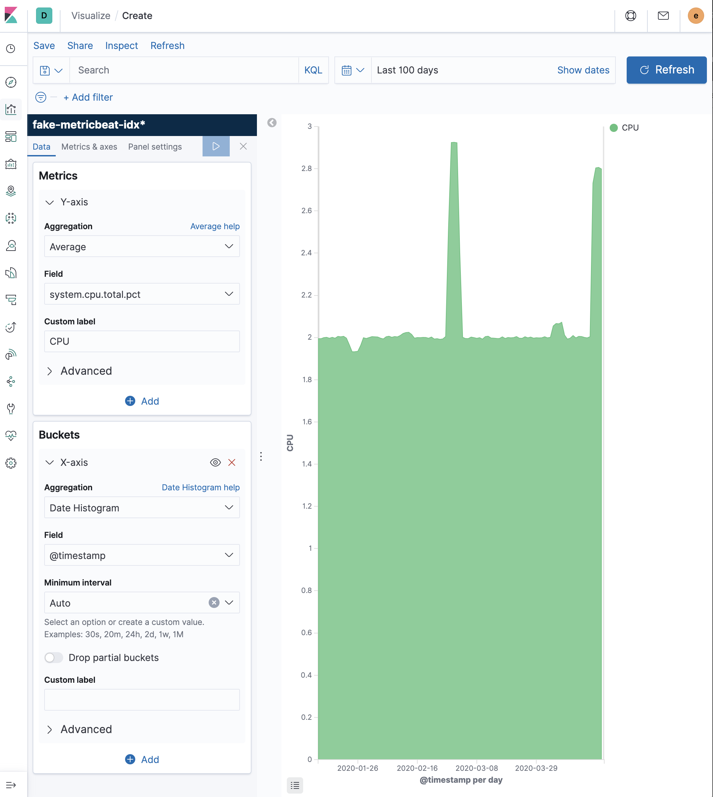
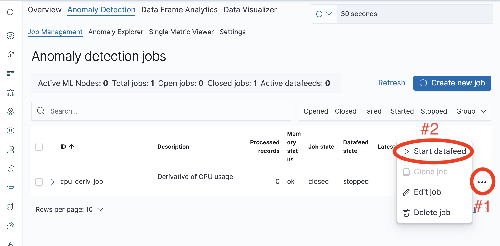
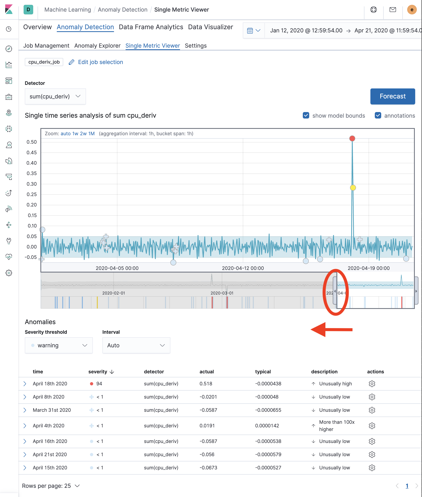

## Introduction

In this blog, we use Elastic machine learning (ML) and derivative aggregations to detect sudden unexpected increases or decreases in the _rate-of-change_ of CPU load on servers that are monitored by [Metricbeat](https://www.elastic.co/guide/en/beats/metricbeat/7.6/metricbeat-overview.html).

In order to make this blog easier to follow and the results easy to recreate, we abstract away the requirement for driving data from Metricbeat, and instead generate "fake" Metricbeat data using a Python script that drives data into Elasticsearch.

The instructions in this blog have been tested using Elasticsearch 7.6.

## A note about derivatives

This blog is intended to demonstrate how to use the derivative aggregation in combination with Machine Learning. The derivative can be used for detecting unexpected anomalies in the _rate-of-change_ of a given parameter. Detecting anomalies in the underlying parameter would not require the use of derivatives.

## Driving fake Metricbeat CPU data into Elasticsearch

The [fake-metricbeat-data Python script](https://github.com/alexander-marquardt/fake-metribeat-data) can be used to create Metricbeat-like data that represents CPU usage reported from a server. This will populate an index called " called "fake-metricbeat-idx". This index is populated with CPU values that are in a field called "system.cpu.total.pct".

The above script will create documents in Elasticsearch that look as follows:

```
       {
        "_index" : "fake-metricbeat-idx",
        "_type" : "_doc",
        "_id" : "afF3nHEBA2RtP7aXDmCC",
        "_score" : 1.0,
        "_source" : {
          "system.cpu.total.pct" : "1.7793594753311028",
          "@timestamp" : "2020-01-12T12:19:54.849959"
        }
      }
```

## Visualizing the ingested data

After ingesting the fake Metricbeat data into Elasticsearch, it can be visualized in Kibana. A simple visualization of the "system.cpu.total.pct" field should look similar to the following, although your peaks and troughs will be different, as they are randomly generated:



We can also view the [derivative](https://www.elastic.co/guide/en/elasticsearch/reference/7.6/search-aggregations-pipeline-derivative-aggregation.html) of the above data in Kibana as follows:


## Create an ML job to detect anomalies in the derivative of CPU usage

The blog post called [Custom Elasticsearch Aggregations for Machine Learning](https://www.elastic.co/blog/custom-elasticsearch-aggregations-for-machine-learning-jobs) gives a good overview of how to detect anomalies in the derivative of a value. The instructions given here were taken from this blog, and have been updated to work with our custom dataset and to work with Elasticsearch 7.6.

We first define the [anomaly detector](https://www.elastic.co/guide/en/machine-learning/7.6/ml-configuration.html) job as follows :

```
PUT _ml/anomaly_detectors/cpu_deriv_job
{
  "description": "Derivative of CPU usage",
  "analysis_config": {
    "bucket_span": "1h",
    "detectors": [
      {
        "detector_description": "sum(cpu_deriv)",
        "function": "sum",
        "field_name": "cpu_deriv"
      }
    ],
    "influencers": [],
    "summary_count_field_name": "doc_count"
  },
  "model_plot_config": {
    "enabled": "true"
  },
  "data_description": {
    "time_field": "@timestamp"
  }
}
```

And we then define the [data feed](https://www.elastic.co/guide/en/machine-learning/7.6/ml-dfeeds.html) that feeds into the above job as follows

```
PUT _ml/datafeeds/datafeed-cpu_deriv/
{
  "job_id": "cpu_deriv_job",
  "indices": [
    "fake-metricbeat-idx"
  ],
  "aggregations": {
    "buckets": {
      "date_histogram": {
        "field": "@timestamp",
        "fixed_interval": "1h",
        "time_zone": "UTC"
      },
      "aggregations": {
        "@timestamp": {
          "max": {
            "field": "@timestamp"
          }
        },
        "avg_cpu": {
          "avg": {
            "field": "system.cpu.total.pct"
          }
        },
        "cpu_deriv": {
          "derivative": {
            "buckets_path": "avg_cpu"
          }
        }
      }
    }
  }
}
```

Preview the data feed to make sure it is working correctly as follows:

```
GET _ml/datafeeds/datafeed-cpu_deriv/_preview
```

Which should return something similar to the following that contains the "cpu\_deriv" value (note that the first entry is missing this derivative value as expected):

```
[
  {
    "@timestamp" : 1578833994849,
    "doc_count" : 162
  },
  {
    "@timestamp" : 1578837594849,
    "cpu_deriv" : 0.005176388888889161,
    "doc_count" : 240
  },
  etc ...
```

Now the ML job has created. But we still need to execute the job.

## Executing the ML job

Go to the machine learning in Kibana, and then click on "Manage jobs" as shown below:


You should see a screen that looks like the following. Noice that the "Processed records" for our job is 0. This indicates that the job has not been executed.


Start the data feed as follows:



Then select the date range that you want the analysis to run on. For this job, select "Start at the beginning of data" and "No end time (Real-time search)", and then click on "Start" as follows:


After executing the above,  you will see that the number of processed records has increased, and that the "Datafeed state" is "started". You can then click on the icon to show the job in the single metric viewer as follows:


After the above, you will see the time series data focused on a small date range. Expand the range by dragging the selection tool (highlighted below) to the left.



After expanding the range, we can see that the graph is similar to the data that we previously graphed. The expanded graph is shown below:


## A multi-metric job where one of the detectors uses the derivative data feed

If we wish to define multiple anomaly detectors on the CPU derivative data feed, then we can simply add more detectors to the anomaly detector. For example, we could add an additional detector on the average CPU. Note that the "field\_name" that is used in the anomaly detector is created by the aggregation in the data feed.

```
PUT _ml/anomaly_detectors/cpu_deriv_job_multi
{
  "description": "Multimetric - Derivative of CPU usage & Sum CPU usage",
  "analysis_config": {
    "bucket_span": "1h",
    "detectors": [
      {
        "detector_description": "sum(cpu_deriv)",
        "function": "sum",
        "field_name": "cpu_deriv",
        "detector_index": 0
      },
      {
        "detector_description" : "sum(avg_cpu)",
        "function" : "sum",
        "field_name" : "avg_cpu",
        "detector_index": 1
      }
    ],
    "influencers": [],
    "summary_count_field_name": "doc_count"
  },
  "model_plot_config": {
    "enabled": "true"
  },
  "data_description": {
    "time_field": "@timestamp"
  }
}
```

Which could then have the data feed defined in a similar manner to the previous example:

```
PUT _ml/datafeeds/datafeed-cpu_deriv-multi/
{
  "job_id": "cpu_deriv_job_multi",
  "indices": [
    "fake-metricbeat-idx"
  ],
  "aggregations": {
    "buckets": {
      "date_histogram": {
        "field": "@timestamp",
        "fixed_interval": "1h",
        "time_zone": "UTC"
      },
      "aggregations": {
        "@timestamp": {
          "max": {
            "field": "@timestamp"
          }
        },
        "avg_cpu": {
          "avg": {
            "field": "system.cpu.total.pct"
          }
        },
        "cpu_deriv": {
          "derivative": {
            "buckets_path": "avg_cpu"
          }
        }
      }
    }
  }
}
```

We can take a quick look at the data feed with the following command

```
GET  _ml/datafeeds/datafeed-cpu_deriv-multi/_preview
```

Which will return something like the response given below, in which we can see that both the "avg\_cpu" and the "cpu\_deriv" are returned (except in the first entry, which is missing the derivative as expected).

```
[
  {
    "@timestamp" : 1578833994849,
    "avg_cpu" : 1.9854444444444443,
    "doc_count" : 162
  },
  {
    "@timestamp" : 1578837594849,
    "avg_cpu" : 1.9906208333333335,
    "cpu_deriv" : 0.005176388888889161,
    "doc_count" : 240
  },
  etc ...
```

We could then execute the above ML job as we did for the previous job.

## Advanced machine learning jobs

The documentation on [Aggregating data for faster performance](https://www.elastic.co/guide/en/machine-learning/7.6/ml-configuring-aggregation.html) gives some good examples of how more complex aggregations can be used in data feeds. In particular, the example of how the "by\_field\_name" (and presumably "partition\_field\_name" as well) can be populated with a terms aggregation is interesting.

Under the hood, Kibana sends REST calls to Elasticsearch to create anomaly detectors and data feeds. You can see how other anomaly detectors and data feeds look with the following:

```
GET _ml/anomaly_detectors
GET _ml/datafeeds
```

Viewing how Kibana creates more advanced jobs should help you to better understand how to create similar jobs through the API. Directly using the ML API may provide additional flexibility and capabilities.

## Conclusion

In this blog we have demonstrated how to run a machine learning job that uses a derivative aggregation to detect anomalies in the rate of change of CPU usage.
