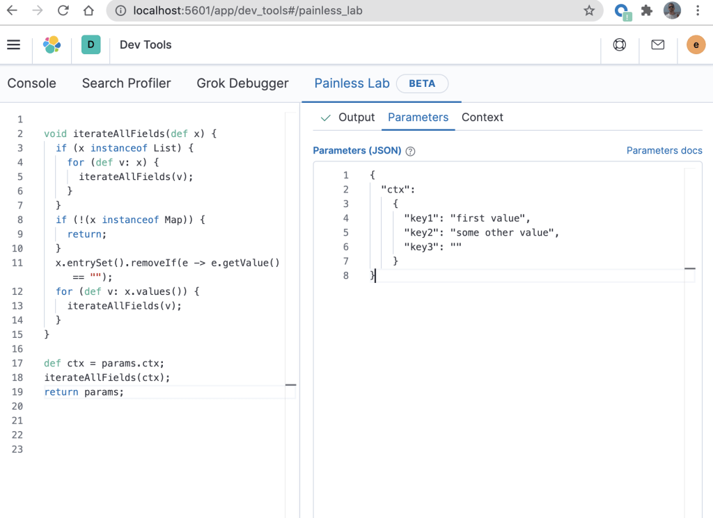

## Introduction

In several previous blog posts I have shown how a Painless script can be used to process new documents as they are ingested into an Elasticsearch cluster. In each of these posts I have made use of the simulate pipeline API to test the Painless scripts.

While developing such scripts, it may be helpful to use [Painless Lab](https://www.elastic.co/guide/en/kibana/current/painlesslab.html) (Beta) in Kibana to debug Painless scripts. In this blog I will show how to use Painless Lab to develop and debug custom scripts, and then show how these can be then easily copied into ingest pipelines.

## Example

In the blog post titled [Using Elasticsearch Painless scripting to recursively iterate through JSON fields](https://alexmarquardt.com/2020/11/06/using-elasticsearch-painless-scripting-to-iterate-through-fields/), we demonstrated how to iterate over all elements in a document, and then delete each field where the value is an empty string. The code was written as a [script processor](https://www.elastic.co/guide/en/elasticsearch/reference/master/script-processor.html) in an [ingest pipeline](https://www.elastic.co/guide/en/elasticsearch/reference/current/pipeline.html), and then simulated.

When developing this Painless script (before putting the code into an ingest pipeline), Painless Lab can be used to catch syntax errors in real time. The code from that blog can be tested in Painless Lab by entering test values in the "Parameters" tab as demonstrated in the right pane shown below.

There are a few modifications to the ingest pipeline code from the previous blog to get it to execute correctly in Painless Lab.

When used in an ingest processor (which is where this will ultimately execute after it is debugged), the script will expect the "ctx" variable to contain the source of the document that is currently being processed. However, because Painless Lab does not (yet) provide a way of directly passing "ctx" to the script, this can be faked by setting "Parameters" to a JSON document with a field called "ctx" (line 2 in the above diagram on the right) that contains the "real" document as its value. We then create a variable "ctx" in the script which is set to "params.ctx" (line 17 in the above diagram on the left).

You can easily view the output by clicking on the "Output" tab as follows.

Notice that in the above "Output" the result is as expected - the "key3" has been removed as it contained an empty string. Now that we have confirmed that the script is behaving as expected, it will require some modification to get it into a state that can be used in an ingest pipeline. In the above example, line 17 and line 19 would need to be removed. You will then end up with the same script as the one that was demonstrated and verified in [Using Elasticsearch Painless scripting to recursively iterate through JSON fields](https://alexmarquardt.com/2020/11/06/using-elasticsearch-painless-scripting-to-iterate-through-fields/). It is therefore quite straightforward to copy code that has been built in Painless Lab using this technique into an ingest pipeline.

## Conclusion

In this blog, I have shown how you can use the Painless Lab for debugging scripts that are used in an ingest processor. This provides real-time syntax verification, and immediate feedback on what the output document will look like.

## Acknowledgement

Thanks to Honza Kral for pointing out the trick of setting ctx = params.ctx.
