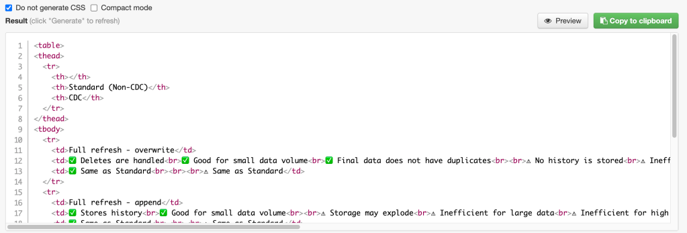

## Introduction

In a [recent article](https://airbyte.com/blog/understanding-data-replication-modes) that I wrote for [Airbyte](http://www.airbyte.com/) it was necessary for me to copy and paste a table from Google Sheets into [Webflow](http://www.webflow.com/). Unfortunately, Webflow doesn’t currently support copy/paste of tables directly in its editor.

In this blog, I present a workaround that can be used to convert a table from Google Sheets into HTML, which can then be written into a Webflow [custom code block](https://university.webflow.com/lesson/custom-code-embed).

## Acknowledgement

Thank you to [Shawn Wang](https://www.swyx.io/) for providing the steps that can be used to copy and paste a table from Google Sheets into HTML so easily.

## Step 1: Draft the table in Google Sheets

Let's assume that you have a table similar to the following in Google Sheets that you would like to copy into a Webflow page\*, or that you need to convert into HTML for any other reason.

\* WordPress allowed me to just natively copy the table from Google Sheets into this article, unlike Webflow 😖.

|  | Standard (Non-CDC) | CDC |
| --- | --- | --- |
| Full refresh - overwrite | ✅ Deletes are handled   ✅ Good for small data volume   ✅ Final data does not have duplicates      ⚠️ No history is stored   ⚠️ Inefficient for large data   ⚠️ Inefficient for high frequency syncs | ✅ Same as Standard         ⚠️ Same as Standard |
| Full refresh - append | ✅ Stores history   ✅ Good for small data volume      ⚠️ Storage may explode   ⚠️ Inefficient for large data   ⚠️ Inefficient for high frequency syncs   ⚠️ Final data will contain duplicates | ✅ Same as Standard         ⚠️ Same as Standard |
| Incremental - append | ✅ Efficient for high frequency syncs   ✅ Stores history   ✅ Primary key not required            ⚠️ A suitable cursor must be available   ⚠️ Final data may contain duplicates   ⚠️ Deletes are not detected   ⚠️ Intermediate states not captured | ✅ Efficient for high frequency syncs   ✅ Stores history   ✅ Deletes are transmitted and logged   ✅ Intermediate states captured   ✅ No cursor field is required      ⚠️ Primary key required   ⚠️ Final data may contain duplicates   ⚠️ Not available for all sources   ⚠️ Requires access to the transaction log |
| Incremental - deduped history | ✅ Efficient for high frequency syncs   ✅ Stores history   ✅ De-duplicates final data               ⚠️ Primary key required   ⚠️ A suitable cursor must be available   ⚠️ Deletes are not detected   ⚠️ Intermediate states not captured | ✅ Efficient for high frequency syncs   ✅ Stores history   ✅ Deletes are handled   ✅ Intermediate states captured   ✅ De-duplicates final data   ✅ No cursor field is required      ⚠️ Primary key required   ⚠️ Not available for all sources   ⚠️ Requires access to the transaction log |

Paste the table into [Tables Generator](https://www.tablesgenerator.com/html_tables) - be sure that you have selected the "HTML" tab as shown below:


In this example, I have selected the checkbox that says "**Do not generate CSS**" (but if you want to include the styles, you can!). You can click on the green button to copy the generated HTML to the clipboard as shown below.



## View the table corresponding to the HTML

Paste the generated HTML into into the [HTML renderer at W3Schools](https://www.w3schools.com/html/tryit.asp?filename=tryhtml_table) and click on the green "**Run >**" button to see how it looks. For the HTML that I have pasted, it looks as follows:


  
Add a border between the cells by modifying the **table** tag (first line in the above code) as follows:

```
<table border=”1″>
```

Your generated table should now look as follows:


That’s starting to look pretty good! You can directly edit the HTML as much as you like to get it to match your styling requirements. Once you have finished editing and viewing the HTML, you can copy it into a custom code block in your Webflow (or whatever) page.

## Conclusion

This article has taken your through several quick steps to help you convert a Google Sheets table into HTML. Enjoy!
