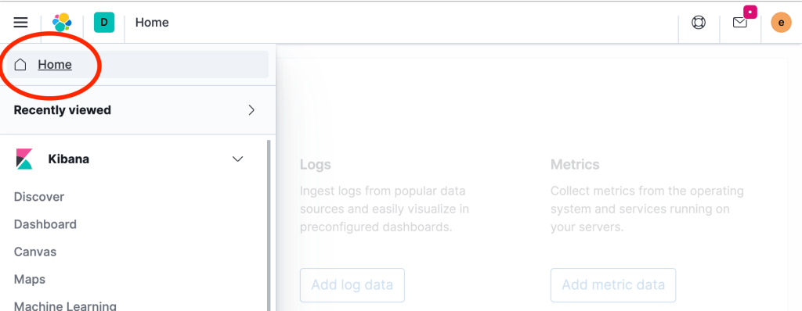
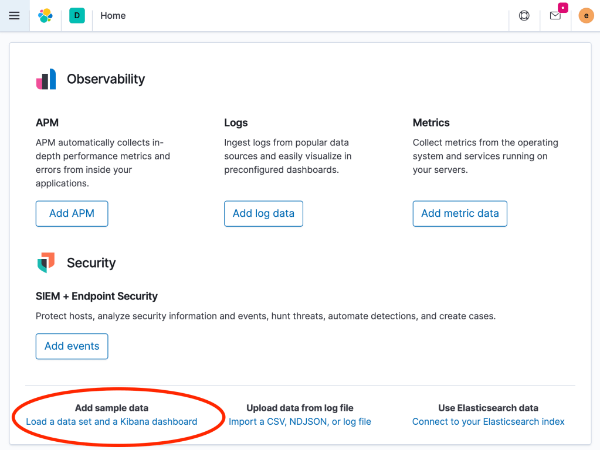
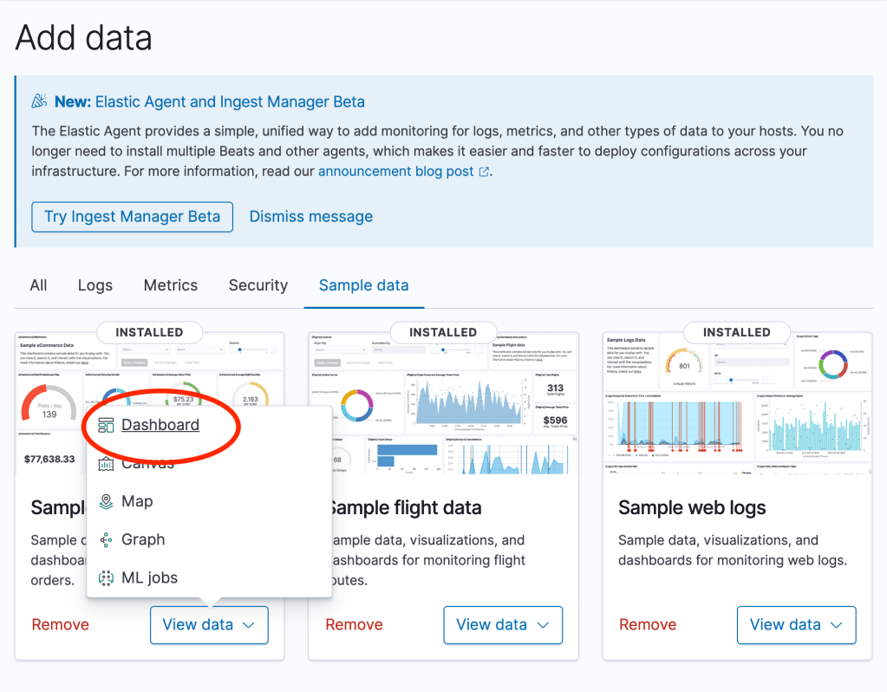
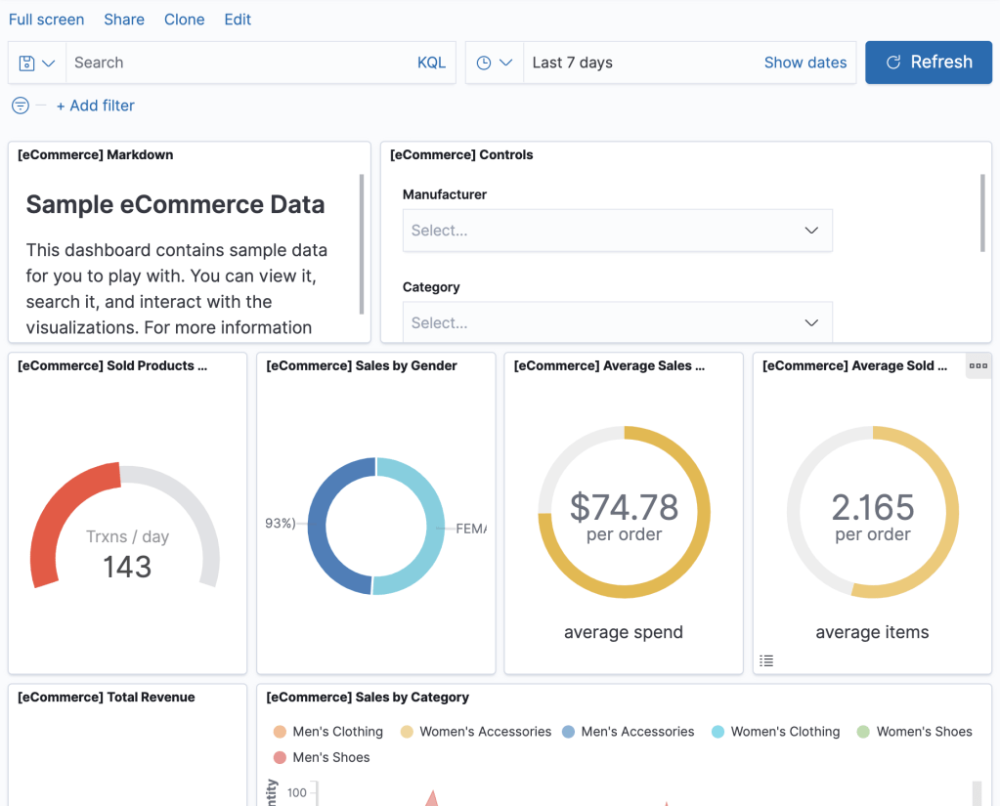

## Introduction

Kibana visualizations are built to work on a specific index pattern. However, the underlying index pattern used for the visualization may change. If this happens, for many of the visualizations (Area, Pie, etc.), there is currently not a clean way to change the underlying index pattern.

In this blog, I will demonstrate how to change the index pattern that is used for visualizations that are already present in your dashboard.

**Warning**: The method shown here is not officially sanctioned and may not work for all kinds of visualizations and/or may not work at some point in the future. Please be sure to make backups of your data and of your Kibana objects before attempting to implement follow the method suggested in this article.

## Version

This blog has been tested with Elasticsearch and Kibana version 7.9.2.

## TSVB Visualizations

Index pattern for TSVB visualizations [can be changed directly in Kibana](https://www.elastic.co/guide/en/kibana/current/dashboard.html#fiter-the-data-fields) and so TSVB visualizations are not a focus of this article, and the method described here does not apply to them.

However, if for some reason you wish to

## Naming index patterns to make future modifications easier

## Install sample data

For purposes of this blog, we will install the sample data that is distributed with Kibana. You can access and install the sample data packages by going to the home page by clicking on "Home" as follows:

And then clicking "add sample data" as follows:

This will take you to an "Add data" page, where you can select the sample data sets that you wish to install. In this blog we will be working with "Sample eCommerce orders".

## View the sample eCommerce orders dashboards

Go to the eCommerce dashboard by clicking on "View data" -> "Dashboard" as follows:

This should then bring up the Sample eCommerce Data dashboard which will look as follows:

## Edit a visualization

Next we will select one of the visualizations to edit it:

## Acknowledgements

Thanks to my colleagues Doug Nelson and Henrik Gelius for guiding me on the method described in this blog.
